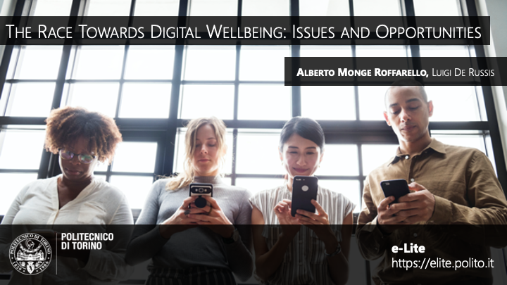

On May 6, 2019, I presented the paper "The Race Towards Digital Wellbeing: Issues and Opportunities" at the audience of ACM CHI 2019 (International CHI Conference on Human Factors in Computing Systems), held in Glasgow, UK.
  
The paper provides an overall perspective of contemporary mobile apps designed for for breaking "smartphone addiction" and achieving "digital wellbeing". It presents, in particular, a functionality review of the 42 most popular digital wellbeing apps available in the Google Play Store, a thematic analysis of more than 1000 users' reviews, and an in-the-wild study of a digital wellbeing app named Socialize. Results show that contemporary digital wellbeing apps are liked by users and useful for some specific use cases, but they are not sufficient for effectively changing users' behavior with smartphones: promising areas to be explored include the design of digital wellbeing apps that support the formation of new habits and promote self regulation through social support.

More information:
* [PDF of the paper](https://iris.polito.it/handle/11583/2724317#.X7E_xhNKjlw)
* [Link to the ACM DL](https://dl.acm.org/doi/10.1145/3290605.3300616)
* [Presentation slides](https://www.slideshare.net/AlbertoMongeRoffarel/the-race-towards-digital-wellbeing-issues-and-opportunities)
* [Video of the presentation](https://www.youtube-nocookie.com/embed/iE34A1agELI)
