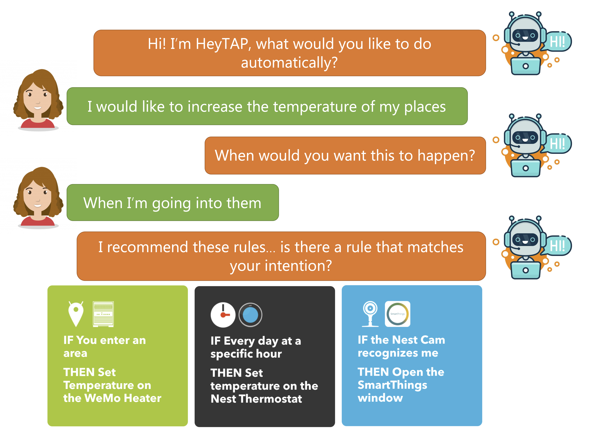

Our paper "From Users' Intentions to IF-THEN Rules in the Internet of Things" has been accepted to <a href="https://dl.acm.org/journal/tois">ACM Transactions on Information System (TOIS)</a> as part of the <a href = "https://dl.acm.org/doi/10.1145/3381926">special issue on conversational search and recommendation</a>!
  
The paper presents HeyTAP2, a semantic Conversational Search and Recommendation (CSR) system that combines a semantic recommendation algorithm and a navigation-by-preference approach. By exploiting a conversational agent, the user can communicate her current personalization intention by specifying a set of functionality at a high level, e.g., to decrease the temperature of a room when she left it. Stemming from this input, HeyTAP2 implements a semantic recommendation process that takes into account the current user’s intention, the connected entities owned by the user, and the user's long-term preferences revealed by her profile. If not satisfied with the suggestions, the user can converse with the system to provide further feedback, i.e., a short-term preference, thus allowing HeyTAP2 to provide refined recommendations that better align with the her original intention. Evaluation results show that the system outperforms similar baseline recommender systems, with recommendation accuracy and similarity with target items that increase as the interaction between HeyTAP2 and the user proceeds.

More information:
* [PDF of the paper](https://iris.polito.it/retrieve/handle/11583/2860780/421331/hiot.pdf)
* [Link to the special issue](https://dl.acm.org/doi/10.1145/3381926)
* [Source code of the algorithm](https://git.elite.polito.it/public-projects/intrec)
