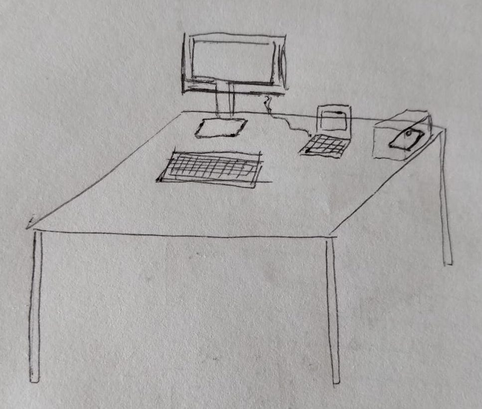

Our paper "Coping with Digital Wellbeing in a Multi-Device World" has been accepted to <a href="https://chi2021.acm.org/">CHI 2021</a>!

  
The paper is a first attempt to move the "digital wellbeing" topic towards a multi-device perspective. Despite a growing interest on improving people's relationship with technology, indeed, researchers and media often relate digital wellbeing as a problem that characterize single technological sources at a time, with a particular focus on smartphones.

Through an analysis of 322 popular tools for digital self-control and a background interview and a co-design and sketching exercise with 20 users, the paper provides insights to better cope with digital wellbeing in a multi-device context through an analysis of 322 popular tools for digital self-control and a background interview and a co-design and sketching exercise with 20 users. Findings highlight the importance of the underlying task and suggest the need of designing more integrated and adaptable tools able to analyze and make sense of data collected from a variety of sources. Furthermore, results also call for digital wellbeing solutions that go beyond technological tools, encompassing social, educational, and even political factors.

More information:
* [PDF of the paper](https://iris.polito.it/retrieve/handle/11583/2862497/423067/multidevicedwb.pdf)
