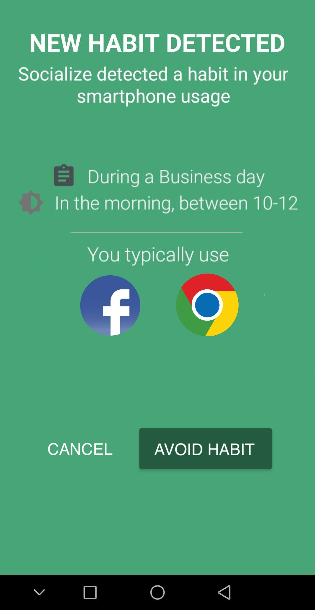

Our paper "Understanding, Discovering, and Mitigating Habitual Smartphone Use in Young Adults" has been accepted to <a href="https://dl.acm.org/journal/tiis">ACM Transactions on Interactive Intelligent Systems (TiiS)</a>!
  

People, especially young adults, often use their smartphones out of habit: they compulsively browse social networks, check emails, and play video-games with little or no awareness at all. The paper investigates how to quantitatively discover smartphone habits and mitigate their disruptive effects.

It first reports on a data analytic methodology based on clustering and association rules mining to automatically discover complex smartphone habits from mobile usage data, that have been assessed over more than 130,000 phone usage sessions collected in-the-wild. Then, it presents Socialize, a habit-forming digital wellbeing app that makes use of implementation intentions and just-in-time reminders to assist users in replacing existing (and unwanted) smartphone habits, e.g., browsing Facebook at work, with new and desirable habits that do not involve the usage of the mobile device. An in-the-wild evaluation with 20 smartphone users shows evidence that the app can effectively assist users in better controlling their smartphone use, with just-in-time reminders that can significantly reduce the impact of unwanted smartphone habits.

More information:
* [PDF of the paper](https://elite.polito.it/files/papers/habitsdetection.pdf)
* [Source code of the app](https://git.elite.polito.it/public-projects/socialize-v2)
