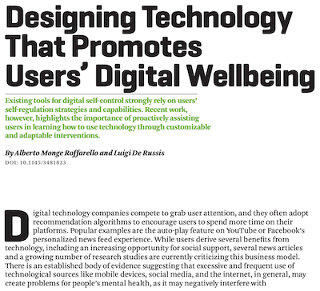

The Fall 2021 issue of the ACM XRDS magazine is dedicated to the topic "Is Computing Toxic?". For that issue, our paper "Designing technology that promotes users' digital wellbeing" reflects on the current state of digital wellbeing and related technologies, strategies, and tools. Existing tools for digital wellbeing, indeed, strongly rely on users' self-regulation strategies and capabilities. Recent work, however, highlights the importance of proactively assisting users in learning how to use technology through customizable and adaptable interventions, which are further discussed in the paper.

More information:
* [PDF of the paper](https://iris.polito.it/retrieve/handle/11583/2915952/506643/Designing%20Technology%20That%20Promotes%20Users%27%20Digital%20Wellbeing.pdf)
