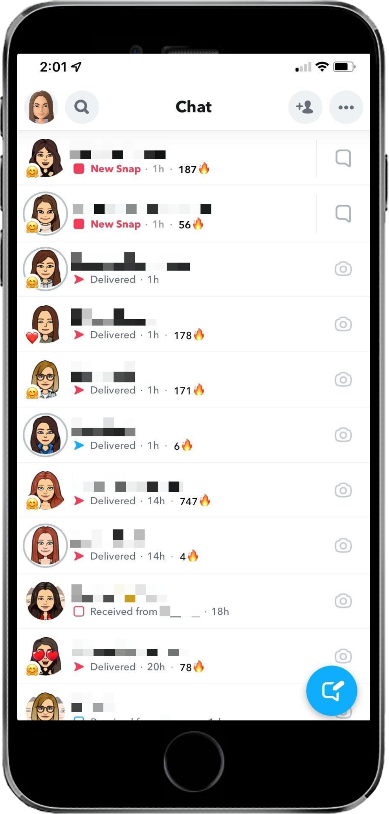

People's digital wellbeing has been traditionally considered as an end-user responsibility by the research community. Unfortunately, previous attempts to support users’ digital wellbeing, e.g., through digital self-control tools, have been found to be ineffective in the long term, while many tech companies continue to adopt “attention-capture” designs that undermine users’ sense of agency and self-control. All in all, researchers pointed out that one of the main (and perhaps insurmountable) issues of contemporary DSCTs lies in their "external" nature, which prevents them from easily changing the problematic design patterns and functionality of an app or a website. In other words, DSCTs do not solve the inherent contradiction of designing technologies to reduce the usage of other technologies, especially in a business model that incentivizes frequent and continuous usage.

We believe there are still open challenges and opportunities for the HCI community to explore how to (re)align technology with people’s digital wellbeing. Our idea is that digital wellbeing should be taken into account at every stage of the design process of a digital service. 

Following this idea, we organized an Unternational workshop called "Designing for Meaningful Interactions and Digital Wellbeing," co-located within the international conference <a href="https://sites.google.com/di.uniroma1.it/avi2022/">"AVI 2022 - International Conference on Advanced Visual Interfaces,"</a> in cooperation with ACM. The workshop website can be found here: <a href = "https://sites.google.com/view/design4dwb/">https://sites.google.com/view/design4dwb/.</a>

Furthermore, we also started investigating what we called **Attention-Capture Damaging Patterns (ACDPs).** Our work is motivated by the growing public discussion and research attention on the negative aspects of overusing technology. We all know that digital services like social media and video games often capture us, even against our will. We therefore investigated how these digital services can capture our attention so much and, in particular, if this attention-capture can be created by design.

Specifically, we conducted a systematic literature review to shed light on the definition, impacts, and strategies of ACDPs. Our work - done in collaboration with the [Human-Computer Interaction Lab](https://kailukoff.com) at Santa Clara University, CA (USA) - resulted in a typology of eleven patterns leading to attentional harm. We also created a website with the typology – [attetentioncapture.com](http://attentioncapture.com/) - to increase the reach of our work among the public and design professionals.

Overall, designers use ACDPs in digital interfaces to capture the user's attention and maximize metrics like time spent and interactions. To this end, they exploit users' psychological vulnerabilities and cognitive biases. Unfortunately, using these patterns can result in the user becoming distracted from their intended goals, losing the sense of time and control, and experiencing regret. 

Our work divides ACDPs into two main categories: deceptive and seductive patterns. _Deceptive designs_ – as the name suggests – introduce some forms of deception in the user interface to deceive users into performing some actions rather than others. An example is a pattern called **Fake Social Notifications,** common across different kinds of digital services, including video games, social media, and messaging applications. In its basic form, it's a pattern through which a digital platform sends messages pretending to be a real user. In the figure, you can see an example from LinkedIn: the platform asks the user to try a premium plan by sending an automatic message – and this violates the expectation that messages in a chat should actually be from a real person.

The other category of ACDPs is what we call _seductive designs_. These patterns are not necessarily deceptive but tempt users with short-term satisfaction to engage them more frequently and for a long time. The figure, for example, shows the **Neverending Autoplay** pattern on YouTube: when the current video ends, the platform automatically plays a new recommended video by default.

Another seductive design is **Playing By Appointment** – a pattern through which the user is forced to use a digital service at specific times that are defined by the service rather than the user. The pattern originated from the gaming community but can also be generalized to social media use. It is often engineered to encourage users to re-visit a digital service to avoid losing something, like a badge or the possibility of unlocking some achievements. The example reported in the figure is about Snapchats' social streaks, which count how many consecutive days two people have been sending Snaps to each other. Here, even a single day without sending a Snap breaks the streak. 

Besides identifying different kinds of patterns, our review shows that ACDPs – especially seductive designs – automate the user experience, reducing the need for autonomous decision-making. This is sometimes useful and may also improve usability. However, such a strategy may also be a deliberate design decision to induce experiences of normative dissociation – all those situations during which we unconsciously consume content. Furthermore, ACDPs nearly always adopt a variable reward technique. Specifically, they create the illusion that there is always new exciting content to be consumed, but this is not always true. For example, platforms like TikTok or YouTube Shorts continuously suggest new videos to watch. Still, the quality of the next recommendation cannot be predicted by us, at least precisely: we are, therefore, trapped in a loop, hoping that the next video will be more exciting than the previous ones.

Overall, we see our typology as a promising starting point to establish new procedures for evaluating existing interfaces and support designers in adopting patterns that preserve and respect the users' attention. Furthermore, we hope that our work will give rise to new regulations and policies, something that is already happening for dark patterns that lead to financial and privacy harm. Read the paper by following the links at the end of page, and watch the [10-mins video presentation](https://youtu.be/Bw9m8j3_jJ0) on YouTube!

<iframe width="560" height="315" src="https://www.youtube-nocookie.com/embed/Bw9m8j3_jJ0" title="YouTube video player" frameBorder="0" allow="accelerometer; autoplay; clipboard-write; encrypted-media; gyroscope; picture-in-picture; web-share" allowFullScreen></iframe>

#### References
* **Defining and Identifying Attention Capture Damaging Patterns in Digital Interfaces**  Alberto Monge Roffarello and Luigi De Russis, Proceedings of the 2023 CHI Conference on Human Factors in Computing Systems (CHI ‘23)  
[[pdf]](https://baltea.polito.it/owncloud/index.php/s/9LNT125rVOfWaB4) 
* **Towards Understanding the Dark Patterns That Steal Our Attention**  Alberto Monge Roffarello and Luigi De Russis, Proceedings of the 2022 CHI Conference Extended Abstracts on Human Factors in Computing Systems (CHI ‘22)  
[[pdf]](https://iris.polito.it/retrieve/handle/11583/2955697/579805/dpimpact.pdf)
* **Designing for Meaningful Interactions and Digital Wellbeing**  Alberto Monge Roffarello, Luigi De Russis, Panagiotis Apostolellis, R.X. Schwartz, Proceedings of the 2022 International Conference on Advanced Visual Interfaces (AVI ‘22)  
[[pdf]](https://iris.polito.it/retrieve/handle/11583/2966052/e384c434-c873-d4b2-e053-9f05fe0a1d67/digitalwellbeing.pdf)
