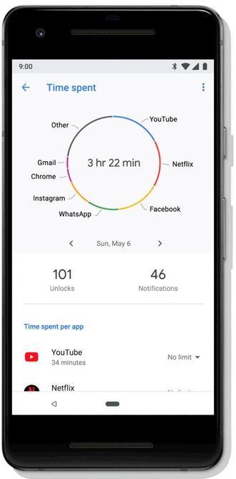

In the technological era we are living in, users interact with a plethora of "smart" devices every day, ranging from personal computers to smartwatches and voice assistants. While users derive several benefits from using these devices, the last few years have seen a growing amount of public discussion and research attention on the negative aspects of overusing technology, from smartphones to social media and the Internet in general. Many people feel nowadays conflicted about the amount of time they spend with digital technologies, especially when devices are used passively, or as a tool for detracting from people’s lives. Recently, even tech giants like Google and Apple have introduced tools for monitoring, understanding, and limiting technology use in their operating systems. Google, in particular, envisioned a new type of wellbeing to be considered in contemporary society, the so-called <a href="https://wellbeing.google/">"digital wellbeing"</a>.
  
My research in the digital wellbeing context aims at exploring novel solutions to promote a conscious and meaningful use of technology.

