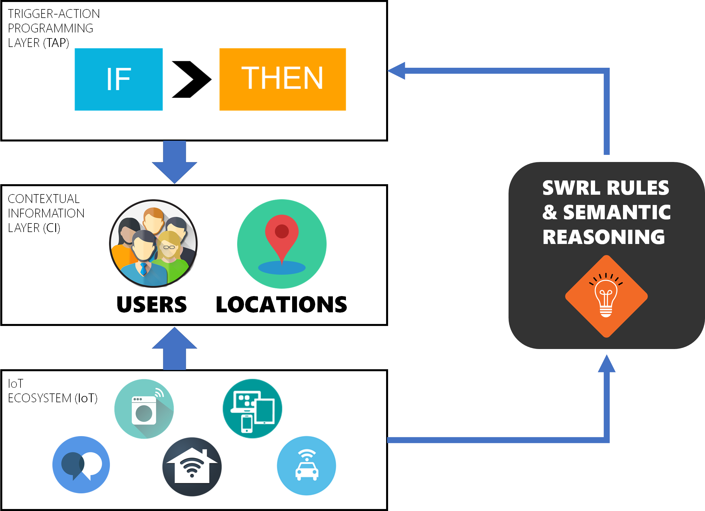

To simplify the definition of IF-THEN rules, we explored the adoption of semantic-based technologies. Our EUPont ontolgy, in particular, is a high-level representation for end-user development that allows the definition of abstract and technology-independent IF-THEN rules that can be adapted to different contextual situations, independently of manufacturers, brands, and other technical details. The aim is to simplify the processes needed by end users to define personalizations: by defining IF-THEN rules such as <i>"if I enter a closed space, then cool the environment"</i>, users are not requested to specify technological details, and they can personalize the functionality of their connected entities with fewer rules, fewer mistakes, and in less time.
  
An <a href ="http://elite.polito.it/ontologies/eupont-ifttt.owl">instantiation of EUPont for IFTTT</a> models all the 379 devices and services (100%) available on the popular platform as of March, 2017. We also manually mapped in the EUPont representation 951 IFTTT triggers out of a total of 976 (97.44%), and 528 actions out of the 551 (95.83%) available on IFTTT on the same date. Moreover, EUPont has been evaluated in terms of understandability, completeness, and usefulness, especially with user studies.   
Check out the <a href="http://elite.polito.it/ontologies/eupont.owl">OWL ontology!</a>

#### References
* **A High-Level Semantic Approach to End-User Development in the Internet of Things**, Fulvio Corno, Luigi De Russis, and Alberto Monge Roffarello, International Journal of Human-Computer Studies [[pdf]](https://iris.polito.it/handle/11583/2720712#.X7E_ZhNKjlw)
* **End User Development in the IoT: a Semantic Approach**, Alberto Monge Roffarello, Proceedings of 14th International Conference on Intelligent Environments (IE '2018) [[pdf]](https://iris.polito.it/handle/11583/2705010#.X7E-1BNKjlw)
* **A High-Level Approach Towards End User Development in the IoT**, Fulvio Corno, Luigi De Russis, and Alberto Monge Roffarello, Proceedings of the 2017 CHI Conference Extended Abstracts on Human Factors in Computing Systems (CHI '17) [[pdf]](https://iris.polito.it/handle/11583/2665147#.X7E_VBNKjlw)
* **A Semantic Web Approach to Simplifying Trigger-Action Programming in the IoT**, Fulvio Corno, Luigi De Russis, and Alberto Monge Roffarello, IEEE Computer [[pdf]](https://iris.polito.it/handle/11583/2691911#.X7E_5hNKjlw)

